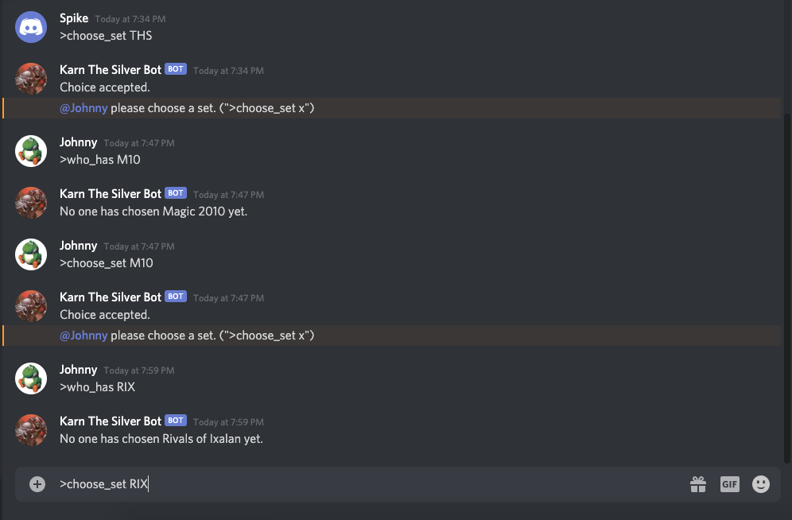
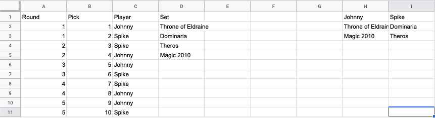

# BCDbot
A Discord bot for automating Block Constructed Drafts, a fantasy football-style custom format for the game Magic: the Gathering.
Manages players, picks, and time banks and offers QoL tools such as generating legal set choices. Also records picks on a Google Sheets for easy referencing.
Issue commands prefixed with '>' (e.g. ">choose_set Ixalan").

## CAVEAT: 
The data sets being used in this file, namely the entire data directory and gui/js/clumpscores_db.js and gui/js/clumpscores_sorted.js are not generated from code within this repository. To learn more, see Geoff's BlockConstructed Planner project at https://github.com/geoffreylee/BlockConstructedPlanner to generate the necessary data for a new ruleset.

## Commands:

### General:
* **info** - Lists bot info.
* **help** - Lists commands.
* **load_session [session name]** - Loads the session with the given name.
* **save_session** - Saves the current session state.

### Setup:
* **new_session [session name]** - Starts a new session with the given name.
* **set_num_picks [n]** - Sets the number of set picks for the session.
* **set_starting_time [n]** - Sets the starting amount of time alloted to each player for picks.
* **add_players [player1, player2, ...]** - Adds a comma-separated list of players to the session.
* **add_banlist [card1, card2, ...]** - Adds a comma-separated list of cards to the session's banlist.
* **add_sets [set1, set2, ...]** - Adds a comma-separated list of sets to the session.
* **add_exclusive [set1, set2, ...]** - Adds a comma-separated list of sets as an exclusive group to the session. (i.e. set1 can't be taken by the player with set2)
* **claim_user [name]** - Links the caller's Discord account to the player name. (So people can't pick for them)
* **finish_setup** - Finishes the setup phase and begins the pick order draft.

### Pick order draft:
* **choose_position [n]** - Choose the n-th position. (1-indexed for simplicity)
* **available_positions** - Gives a list of positions available to the player.

### Set draft:
* **choose_set [set name]** - Choose the set with the given name. (Assuming it is a legal pick)
* **my_available_sets** - Gives a list of sets available to the player.
* **who_has [set name]** - Gives the player who has the set with the given name. (Or tells you no one has it yet)
